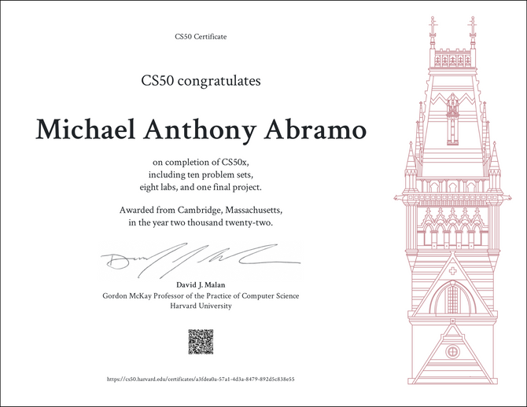

<header>

<nav>* [Home](https://icy-sunset-6501.on.fleek.co/) * [Medium](https://medium.com/@mabramo11) * [Twitter](https://twitter.com/SonnyTheDegen) * [Reddit](https://www.reddit.com/user/MyKeyGTrades) * [Github](https://github.com/SonnyMonroe)
</nav>

</header>

# **My Crypto Adventures in 2022: From Degen to Dev** Crypto in 2022 has been a rollercoaster ride, with a series of game-changing events that have sent shockwaves through the industry. From the Olympus DAO forks that offered eye-popping APYs to the collapse of FTX, it’s been a year of highs and lows that has kept investors and enthusiasts on their toes. From the day I entered in late 2021, I’ve been constantly amazed and sometimes bewildered by the wild ride that is the world of cryptocurrency. Thinking back on 2022, I wanted to share my thoughts and experiences in this review. Whether you’re new to crypto or a seasoned pro, I hope my insights and reflections will be helpful as you navigate this exciting and sometimes overwhelming world of Decentralized Finance (DeFi) and the overall crypto space. I will discuss the following topics: ##### **What is Yield Farming?** _ My Yield Farming Experiences & Thoughts: ##### **Significant Events in DeFi (The Bad):** _ Time Wonderland & Sifu: _ Solidly Wars: _ The Death of Terra Luna: ##### **Lessons Learned From My Degen Days:** ##### **My Favorite Crypto Communities:** _ Cosmos: _ Fantom: _ Ethereum: ##### **Switching to Programming / From Degen to Dev:** _ Harvard Universities CS50 \* Programming on Ethereum ##### **Crypto Meetup Story:** ##### **Why I'm both passionate and optimistic about the future of DeFi:** ##### **2023 DeFi and Crypto Freshmen: A Beginner's Survival Guide:** ##### **Closing Remarks:** I won't go into too much detail about these events. This is just a summary that I'll look back on from time to time. In addition, I would like this to serve as a way to get my scattered thoughts in order. If you are reading this, I hope you can find inspiration in documenting your own experiences with DeFi and crypto. So, here it is - my 2022 reflection on my year in crypto. ##### **What is Yield Farming?** One of the biggest takeaways from my year in DeFi has been my involvement in yield farming. Yield farming is a way to earn tokenized rewards for providing liquidity to decentralized finance (DeFi) protocols. DeFi protocols are built on blockchain networks and offer financial services such as lending, borrowing, and trading. This is all possible due to smart contracts. Smart Contracts are digital contracts that use code to automate the execution of agreements between parties, making transactions more efficient and secure. To participate in yield farming, an individual or entity can supply assets such as cryptocurrency to a liquidity pool, which is essentially a collection of assets that can be traded on a decentralized exchange (DEX). By supplying assets to the liquidity pool, the individual or entity is helping to facilitate trades on the DEX and is therefore entitled to a share of the fees generated from these trades. This share is typically paid out in the form of tokens that are specific to the DeFi protocol being used.

##### My Yield Farming Experiences & Thoughts Yield farming was my first real foray into the world of DeFi, and I have to say, it's been an incredibly humbling but exciting experience. I started yield farming to earn passive income on the cryptocurrencies I hold. Through yield farming, you'll acquire worthwhile insights for understanding the value of specific cryptocurrencies by getting first-hand experience with how efficient or sluggish different DeFi protocols behave. My rationale is the more enjoyable and easier to use, the more likely a DeFi protocol would realize increased adoption. You can learn a lot from a DeFi protocol simply by using them. From yield farming and being an active participant in DeFi, you get a front-row seat on DeFi topics such as game theory, DAO governance, algorithmic stablecoins, token issuance, and on-chain analytics. If you invest in crypto, I cannot overstate the value of trying out these DeFi protocols. I guarantee you will gain valuable insights into the coins and tokens you hold. At the very least, you'll uncover the exhilarating world of DeFi. However, yield farming is not without its risk. It can be extremely risky for a newbie entering DeFi for the first time. Some less unfortunate events I witnessed in DeFi were Sifu getting doxed, the Solidly Wars, and the Terra Luna Death Spiral. ##### **Significant Events in DeFi (The Bad).** ##### **Time Wonderland & Sifu:** Sifu is the Treasury manager for the Time Wonderland Decentralized Autonomous Organization (DAO). At its peak, Time Wonderland maintained over 1 billion dollars of crypto assets in its treasury. Sifu is very active and well-liked within the Time Wonderland community. So it came as a shock when Sifu's real-life identity was revealed as Michael Patryn, co-founder of the infamous QuadrigaCX. QuadrigaCX was a Canadian cryptocurrency exchange that faced financial difficulties and controversy following the unexpected death of its CEO, who was the only person with access to the company's cold storage wallets, resulting in significant losses for its customers. Patryn claims he left the company in 2016 before the company allegedly became a Ponzi scheme resulting in over $200 million in losses after business partner Gerald Cotten died. In September 2022, Wonderland voted to re-hire Patryn aka Sifu as their Risk Officer in a vote which passed with ~90% approval. Since then, Wonderland has been pretty steady with their token (wMemo) surviving the scandal and outperforming many rival DAOs. However, Wonderland may never see the highs it once had with its reputation and trust fractured by this event.

[Source:](https://twitter.com/TheSkyhopper/status/1607658104082292736)

 ##### **Solidly Wars:** In February 2022, Andre Cronje announced Solidly, a Decentralized Exchange that operates entirely on smart contracts. This project can get quite complicated so to save time and effort, I'll just breeze through why Solidly was so hyped. Although not entirely correct, All token emissions would go to Liquidity Providers. The top 25 DeFi protocols on Fantom in terms of Total Value Locked (TVL) received a solidly NFT, which they could use to receive Solidly token emissions. <iframe width="663" height="382" src="https://www.youtube.com/embed/x3vhNw2g-CU" title="Andre's ve(3,3) SOLIDLY Explainer video" frameborder="100px" allow="accelerometer; autoplay; clipboard-write; encrypted-media; gyroscope; picture-in-picture; web-share" allowfullscreen=""></iframe>Wanting to get involved I uncovered veDAO. The entire objective of veDAO was to get one of these Solidly NFTs. I liked the concept and joined veDAO. veDAO quickly acquired 2 billion dollars in TVL, which made it #2 on Fantom. To combat this phenomenon, native Fantom protocols such as Scream, Geist, and SpookySwap, unified to create 0xDAO. When all was said and done, both veDAO and 0xDao acquired a significant amount of voting power for the Solidly emissions. The day Solidly launched, it was riddled with bugs, a shoddy UI, and a congested Fantom blockchain. Andre caved from the backlash and left DeFi for a while. The entire Fantom ecosystem crashed as many of my fellow yield farmers moved on from the Solidly Wars and pivoted their assets and attention to different blockchains (Arura, Metis, and Terra). Which leads me to my next play.

Fantom TVL from January 1, 2022 - March 20, 2022 (78 days total)

##### **The Death of Terra Luna:** Now that the Solidly Wars were done, I was searching for a new DeFi ecosystem to explore. I arrived at Terra in March of 2022\. What drew me to Terra was how well their DeFi ecosystem operated. Decentralized Applications (dApps) such as Anchor, Mirror, and Astroport allowed for frictionless transactions. Additionally, the 19% APY for depositing your UST stable coins on Anchor was enticing enough for me to look past all of the immature tweets by Terra founder Do Kwon.

[Source:](https://twitter.com/dokwoninueth/status/1576721243054964736/photo/1)

###### Just so you get a basic understanding of how Terra Luna worked, below is a quick explanation:

_Terra Luna is a payment platform that uses a special type of cryptocurrency called a stablecoin. Stablecoins are like regular cryptocurrencies, but they're designed to stay the same value as other kinds of money, like dollars or euros. You can use Terra Luna to buy and sell things, save your money, or exchange it for other types of currency. The Terra Luna platform is built on a special kind of computer network called a blockchain, which helps keep your money safe and makes it easy to use._

Anyhow, as much as Terra Luna was praised by its community, it also drew many critics, who rightfully pointed out the flaws of the Terra Luna Ecosystem, citing how the 19% yield is not sustainable and how the entire ecosystem will go to zero in the event of a bank run. The critics wouldn't have to wait long for their theories to come to fruition. On May 9th, 2022, Terra Luna stable coin UST loses its $1 peg after it deployed its available treasury funds to defend the $1 peg and falls to as low as 35 cents. UST never recovered and is trading around 2 cents at the time of this writing.

###### Below is an article from Coindesk which perfectly sums up the Terra Luna Timeline. 👇

[Source:](https://www.coindesk.com/learn/the-fall-of-terra-a-timeline-of-the-meteoric-rise-and-crash-of-ust-and-luna/)

Although it was no secret to the crypto community that this result was entirely possible, it was unreal to see this all happen in real-time. My heart goes out to everyone who lost large sums of their money in all of this. ##### **Lessons Learned From My Degen Days:** I've made a lot of mistakes while yield farming on DeFi protocols, and I've learned a lot from those experiences. I'm not afraid to admit that I made some poor choices and paid a high price for them. But I've learned valuable lessons from those mistakes, and I'm happy to share those experiences and lessons with others. I see those mistakes as a kind of "tuition" that has helped me become a more knowledgeable and experienced investor. I wear those scars as a reminder to always be careful and to continue learning from my mistakes.

<figcaption>Try and guess the crypto 🌙</figcaption>

##### **My Favorite Crypto Communities:** Anyhow, with the lows I've experienced, there were considerably more corners of DeFi where I found communities that were both inspiring and welcoming. Here are a few that come to mind. ##### **Cosmos:** Hands down, DeFi protocols that are built on top of Cosmos all have some of the smoothest user experiences in all of DeFi. Shout out to my favorite software wallet (Keplr) for being a big part of the ease of use with Cosmos Blockchains! Cosmos is one of the most forward-thinking and innovative communities in crypto for its entire existence. I am particularly impressed by how engaged and passionate the Cosmos community continues to be. They take their ideology of sovereign blockchains having complete control over their fortune as seriously as they take their governance. I booked marked this excerpt below which I feel, perfectly represents Cosmos.

##### **Cosmos Co-Founder Ethan Buchman**

> "_At the heart of Cosmos are the principles of sovereignty and interoperability — the right for communities to be sovereign over their infrastructure and applications, and for sovereign communities to be able to peacefully interoperate with one another. This philosophy is grounded in our humility before the extraordinarily rich cultural diversity of human beings. It is a tacit recognition of the fundamental limits of our discretionary reason in organizing planetary sustainability, and yet a call to use technology as simply and as best we can to facilitate sustainable self-governance. Cosmos offers a meta-political economy, one that recognizes the need for the representation of different interests at different scales and for an approach to money that can bridge the gap from local to global and back. Let’s call this philosophy the Mind of Cosmos."_

[Source:](https://medium.com/cosmos-blockchain/the-mind-body-and-soul-of-cosmos-140ee7cec0cd)

##### **Fantom:** Fantom is a blockchain that will forever live rent-free in my heart. I swear it's not due to all of the endearing Halloween-themed protocols that live on the Fantom blockchain. Fantom has a user-friendly, and unique DeFi experience that separates itself from many of its Layer 1 competitors. I would know since as a complete newbie, I learned how to use DeFi through Fantom. Every month or so when I yield farm, I set time aside to catch up with some of my favorite protocols (BeethovenX, Reaper.farm, spooky, and spirit swap). Even with all of the misfortune that occurred with Fantom this year, their community remains spirited and engaged. I'll tell you one thing about Fantom, it's far from the light-hearted "ghost chain" puns I hear from time to time. _(Shout out to Crypto Clay, Professor Crypto Banana, Austin from Blockbytes, and Justin Bebis)._ One of these days, I hope to build a passion project on Fantom. I still keep up with all of Fantom's exciting developments which are in the works for 2023 (Fantom Virtual Machine, Revamped Tokenomic Models which incentivizes new builders, and Andre Cronje's comeback tour). I am still bullish on Fantom and believe it is one of the most undervalued Layer 1 blockchains in crypto.

##### **Ethereum:** I recently delved into the world of Ethereum and was blown away by the depth and potential of this blockchain platform. The community of developers working on Ethereum is truly innovative and driven by a desire to create a more censorship-resistant and transparent society. They also inspired me to dive into blockchain development. Ethereum's focus on censorship resistance and transparency align with my values, and the wealth of innovative developers within its community makes it an exciting space to be a part of. In my research, I came across two books that helped me understand the significance of decentralization and Ethereum's journey: "**The Infinite Machine**" by Defiant Founder Camila Russo and "**The Cryptopians**" by OG crypto journalist, Laura Shin. These books gave me a newfound appreciation for Ethereum and the challenges it has faced, ultimately inspiring me to dive deeper into the world of blockchain development.

### **Switching to Programming / From Degen to Dev:** ##### **Harvard Universities CS50 Course:** In May 2022, I decided to try something completely new and enrolled in Harvard University's CS50 course, even though I had zero programming experience. It was a challenge, but I enjoyed the lectures, which were taught by Prof. David Malan. He made even the most complex topics, like data structures, feel interesting and accessible by using props like puppets. I spent a lot of time watching the lectures over and over to try to understand everything. Even though I had a tough time with the coding, I appreciate how entertaining and helpful the lectures were. CS50 has a huge following, and I can see why. When I finished the course, I felt grateful for everything I learned. I’ll forever have fond memories of CS50.

##### **Programming on Ethereum:** These days, I've been trying my hand at blockchain development, specifically, the 32-hour Chainlink course on YouTube taught by Patrick Collins. I got the suggestion from a Chainlink Developer Advocate I spoke with at a local crypto hangout. Although I have several months, (maybe years) more of programming practice to achieve the necessary skills needed to build safe and efficient blockchain smart contracts, I know Patrick will keep me motivated throughout. I look forward to using developer tooling platforms such as Chainlink which allow for more enjoyable developer experience.

<iframe width="663" height="382" src="https://www.youtube.com/embed/gyMwXuJrbJQ" title="Learn Blockchain, Solidity, and Full Stack Web3 Development with JavaScript – 32-Hour Course" frameborder="0" allow="accelerometer; autoplay; clipboard-write; encrypted-media; gyroscope; picture-in-picture; web-share" allowfullscreen=""></iframe>

##### **Crypto Meetup Story:** Speaking of Crypto meetups, I went to my first crypto hangout in Late October. I am not one to use my phone as I get overwhelmed with having to catch up with all of the conversations that ensue with crypto telegrams. As a result, I mixed up the meetup I was supposed to go to. I thought I was attending a costume party. So I arrived at a penthouse in Back Bay Boston, outfitted from head to toe in a Beetlejuice costume. When the elevator doors opened as I entered the meetup lobby, my heart dropped as I was the only one in a suite full of 200-plus crypto enthusiasts, VCs, and blockchain developers wearing a costume. However, 99% of my time at the meetup, I didn't even realize I was the only one in a costume. The Boston DAO community made me feel welcomed as we laughed off my mishap. I didn't receive one judgmental look or any snarky comments during the two hours I was at the meetup. That might have been the moment I realized that crypto is one of the most welcoming communities I have ever been a part of.

##### **Why I'm both passionate and optimistic about the future of DeFi.** First and foremost, I believe that DeFi has the potential to bring about real change and make today's financial systems more transparent, fair, and accessible to everyone. It allows for greater control and autonomy over our financial decisions and gives us the power to shape the future of finance in a way that benefits us all. This is particularly important in a world where traditional financial systems often exclude or discriminate against certain groups, and where access to financial services is not always equal. In addition to this, I am excited about the innovation and creativity that DeFi brings to the table. The use of smart contracts, decentralized exchanges, NFTs, and other cutting-edge technologies allows for the creation of new financial products and services that were previously unimaginable. This not only opens up new possibilities for how we can use and interact with money, but it also creates opportunities for people to build and grow businesses in this space. Finally, I am bullish on the future of DeFi because I believe that it is here to stay. As more people become aware of and interested in DeFi, I expect to see it continue to evolve and develop. This means that there will be more opportunities for people to get involved and make a positive impact, whether as users, developers, or entrepreneurs. All of these factors make me confident in the long-term potential of DeFi and excited about what the future holds.

## **2023 DeFi and Crypto Freshmen: A Beginner's Survival Guide:**

1\. **Educate yourself before you invest a single dime in crypto:** The crypto space is constantly evolving, and it's important to keep up with the latest developments and trends. Make sure you educate yourself about the basics of blockchain technology and cryptocurrency, as well as the specific projects and protocols you're interested in. 1\. Did you notice how my biggest mistakes were all from my first few months exploring DeFi protocols? If I took the time to better understand the risks and flaws with these protocols then, I would have saved myself a ton of money. You don't have to get rekt to learn in crypto. It cost nothing to join community discords, hang out on crypto Twitter and follow the events in real-time. Hell, even if these protocols were still going strong today, they would still be down %90 or more. If you need proof, look at the weekly chart of your favorite altcoin over the past year. 1\. **Use a hardware wallet:** A hardware wallet is a physical device that stores your crypto offline, making it much harder for hackers to access. This is a secure way to store your crypto and protect your investment. Also, don't leave your crypto on a centralized exchange, as it's vulnerable to bankruptcy, hacks, and theft. 1\. **Connect with a community that aligns with your values**: The crypto community is a friendly and collaborative place, and there are many opportunities to connect with others who share your interests. Join discords forums and communities, attend meetups and conferences, and seek out mentors or advisors who can offer guidance and support. 1\. **Think about what you're passionate about and how you can use your skills and talents to make a difference in the crypto space**. Whether you're a developer, designer, writer, or something else, there are likely opportunities to use your skills to contribute to the community. 1\. **Invest in yourself over crypto:** Instead of rushing to invest in crypto, consider investing in yourself first. Building up your skills and knowledge can provide personal and professional benefits, as well as help you make better investment decisions in the long run. Plus, crypto will be here forever, so there's no need to rush.

## **Closing Remarks** As we come to the end of this exploration of DeFi, it's clear that this exciting and innovative technology has the potential to bring about significant positive change in the world. By providing greater accessibility, transparency, and accountability, DeFi can help build a more fair and inclusive financial system that serves the needs of people and communities around the globe. So, as we move forward into 2023, let's embrace the challenges and opportunities that lie ahead. Whether you're a yield farmer, degen, Web3 journalist, blockchain developer, or simply a spirited DeFi user, we all have a role to play in shaping the future of DeFi and crypto. Let's work together to build a brighter, more decentralized future for all of us. Thank you for joining me on this journey and for taking the time to read my barely coherent blog detailing my misfortunes, experiences, and the compelling world of DeFi. I hope that you've gained a better understanding of the topics discussed and what not to do. And with that, I'll leave you with one final thought: **never underestimate the power of a collective group of people who want nothing more than to bring about radical change, **even if it means turning the world of finance on its head (or, in this case, making it completely decentralized).

